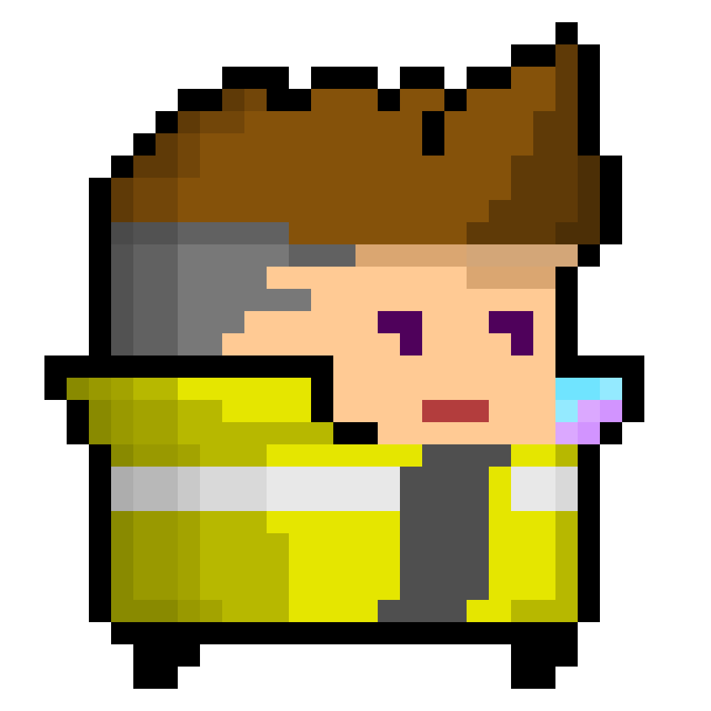
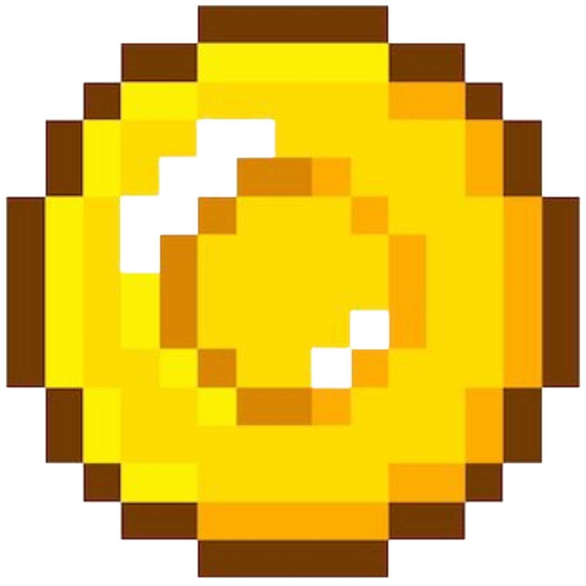

# Dungeon-Flux
Dungeon Flux — рогалик с процедурной генерацией подземелий, где игрок сражается с монстрами, собирает артефакты и прокачивает вооружение. 
<!-- Игра основана на Soul Knight -->

## Исследование подземелья
Игрок отправляется в опасное путешествие по мрачным подземельям, вооружённый лишь старой, но надёжной винтовкой Мосина — верным спутником сквозь опасности.

### Враги
На своём пути игрок столкнётся с различными противниками. Как только он входит в комнату с врагами, двери магическим образом запираются. Выйти из комнаты можно лишь тогда, когда все враги будут повержены. Уклониться от боя не получится — только победа откроет путь дальше.

Каждый побеждённый враг приносит игроку монетки, количество которых зависит от его типа. Эти монетки служат игровой валютой и одновременно счётом — чем больше, тем лучше результат.

### Сокровища
Иногда игрок может найти комнаты, скрывающие сокровища. В таких местах встречаются аптечки, восстанавливающие здоровье, и, возможно, другие ценные находки, способные увеличить шансы на выживание.

### Продвижение на следующий этаж
Подземелье не бесконечно. Чтобы попасть на следующий уровень, необходимо одолеть босса этажа. После победы игроку следует в той же комнате нажать клавишу **<kbd>E</kbd>**, чтобы перейти дальше.

> Продвигайся глубже, собирай монеты, сражайся и выживай — твоя цель: дойти как можно дальше и собрать как можно больше богатств.

### Текстуры 
| Предназначение | Изображение                                   |
| -------------- | --------------------------------------------- |
| Игрок          |       |
| Враг           |    |
| Оружие         |  |
| Монетка        |        |
| Аптечка        |         |

## Геймплей

### Основная механика
- Исследование процедурно генерируемых подземелий
- Сбор оружия, монет и артефактов
- Сражения с монстрами

### Управление

| Действие | Управление |
|----------|------------|
| Передвижение | <kbd>W</kbd> <kbd>A</kbd> <kbd>S</kbd> <kbd>D</kbd> |
| Атака/Стрельба | <kbd>ЛКМ</kbd> |
<!-- | Смена оружия | <kbd>Прокрутка мыши</kbd> | -->
<!-- | Инвентарь | <kbd>E</kbd> | -->

### Особенности
- Процедурная генерация подземелий с использованием алгоритма случайного блуждения
- Разнообразное оружие и магические предметы
- Одиночный режим прохождения (пока что)

## Технические детали

### Используемые технологии

### Архитектура проекта

 

### Генерация подземелий
Подземелья генерируются с помощью алгоритма случайного блуждения, который предоставляет уникальный опыт при каждом прохождении. Каждый уровень представляет собой лабиринт комнат и коридоров, наполненных сокровищами и наградами.

### Графика
Игра использует пиксельную графику, что придает ей особый шарм и стиль, сохраняя при этом современный подход к визуальному оформлению.

### Алгоритмы

#### 1. Генерация подземелья
- **Алгоритм случайного блуждения**
  - Создание основного пути подземелья
  - Генерация начальной и конечной комнат
- **Поиск самой дальней комнаты**
  - Использование Евклидова расстояния
  - Оптимальное размещение выходной комнаты (самая удаленная от старта)

#### 2. Примитивный интеллект
- **Алгоритм преследования игрока**
  - Расчет оптимального пути к игроку
  - Обработка столкновений
  - Система обнаружения застревания
- **Система принятия решений**
  - Выбор атаки или преследования
  - Обработка различных состояний врага до оптимального для атаки

#### 3. Система боя
- **Определение попадания**
  - Проверка пересечения линии атаки и хитбокса противоположника
  - Учет размеров различных типов врагов
- **Спавн врагов**
  - Случайное размещение в пределах комнаты
  - Проверка на перекрытие с другими врагами

#### 4. Система предметов
- **Размещение предметов**
  - Вероятностная система выбора типа
  - Оптимальное распределение в комнате
  - Проверка на перекрытие

#### 5. Система коллизий
- **Проверка столкновений**
  - Проверка пересечений
  - Учет проходимости стен
- **Генерация стен**
  - Различные паттерны для типов комнат
  - Настраиваемые параметры

#### 6. Система эффектов
- **Отрисовка эффектов**
  - Система частиц
  - Плавное затухание
  - Настраиваемые параметры

<!-- ### Система боя
- Разнообразные типы оружия (ближний бой, дальний бой, магическое)
- надо еще подумать. -->

### Структуры данных

#### Комната подземелья

Основная структура для представления комнаты в подземелье

- **Поля:**
  - `Position`: Позиция комнаты в сетке подземелья
  - `Type`: Тип комнаты (Start, Exit, Corridor, DeadEnd)
  - `SubType`: Подтип комнаты, если тип == DeadEnd (Enemy, Treasure, Shop, Boss, Empty)
  - `Enemies`: Список врагов в комнате
  - `Items`: Список предметов в комнате
  - `Connections`: Массив булевых значений для соединений с соседними комнатами
- **Методы:**
  - `IsDeadEnd()`: Проверка, является ли комната тупиком
  - `SetConnection()`: Установка соединения с соседней комнатой
  - `HasConnection()`: Проверка наличия соединения

#### Враг

Структура для представления врага

- **Поля:**
  - `Position`: Текущая позиция врага
  - `Health`: Текущее здоровье
  - `Room`: Ссылка на комнату, в которой находится враг
  - `MoveSpeed`: Скорость передвижения
  - `AttackCooldown`: Время перезарядки атаки
- **Методы:**
  - `MoveTowards()`: Движение к игроку
  - `TakeDamage()`: Получение урона
  - `TryAttackPlayer()`: Попытка атаковать игрока

#### Игрок

Структура для представления игрока

- **Поля:**
  - `Position`: Текущая позиция игрока
  - `Health`: Текущее здоровье
  - `Weapon`: Текущее <a href="#оружие">оружие</a>
  - `Coins`: Количество собранных монет
- **Методы:**
  - `Move()`: Перемещение игрока
  - `TakeDamage()`: Получение урона
  - `CollectItem()`: Сбор предмета

#### Оружие

Структура для представления оружия

- **Поля:**
  - `Cooldown`: Время перезарядки
  - `Damage`: Урон
  - `Range`: Дальность атаки
  - `AttackEffect`: Эффект атаки
- **Методы:**
  - `Attack()`: Выполнение атаки
  - `GetHitEnemies()`: Получение списка пораженных врагов

#### Предмет

Базовый класс для всех предметов

- **Поля:**
  - `Position`: Позиция предмета
  - `IsCollected`: Флаг собранности
  - `Room`: Ссылка на комнату
- **Методы:**
  - `Collect()`: Сбор предмета
  - `OnCollect()`: Действие при сборе предмета

#### Стена

Структура для представления стены

- **Поля:**
  - `Bounds`: Границы стены
  - `IsPassable`: Проходимость стены
  - `Direction`: Направление стены
  - `IsOpen`: Состояние двери
- **Методы:**
  - `Intersects()`: Проверка пересечения
  - `IsPassable()`: Проверка проходимости

## Требования MVP
Минимально играбельная версия игры должна включать следующие компоненты:

### Основные механики
- #### Система передвижения игрока
  - [x] Базовое перемещение (WASD)
  - [x] Коллизии со стенами
- #### Система боя
  - [x] Базовое оружие для игрока
  - [x] Механика стрельбы/атаки
  - [x] Система здоровья и урона
- #### Процедурная генерация подземелий
  - [x] Генерация комнат и коридоров
  - [x] Система дверей между комнатами
  - [x] Размещение врагов и предметов

### Игровой контент
- #### Один тип игрока
  - [x] Базовая модель
- #### Один тип врагов
  - [x] Базовая модель
  - [x] Примитивный интеллект (преследование игрока)
- #### Босс
  - [x] Увеличенная версия обычного врага
  - [x] Повышенное здоровье и урон
  - [x] Увеличенный размер

### Системы
- #### Система прогресса
  - [x] Сохранение состояния игрока между уровнями
  - [x] Система перехода на следующий уровень после победы над боссом
- #### Базовая система предметов
  - [x] Монеты для сбора
  - [x] Аптечки для восстановления здоровья
- #### Минимальный UI
  - [x] Главное меню
  - [x] Отображение здоровья игрока
  - [x] Отображение количества монет
  - [x] Экран победы/поражения
